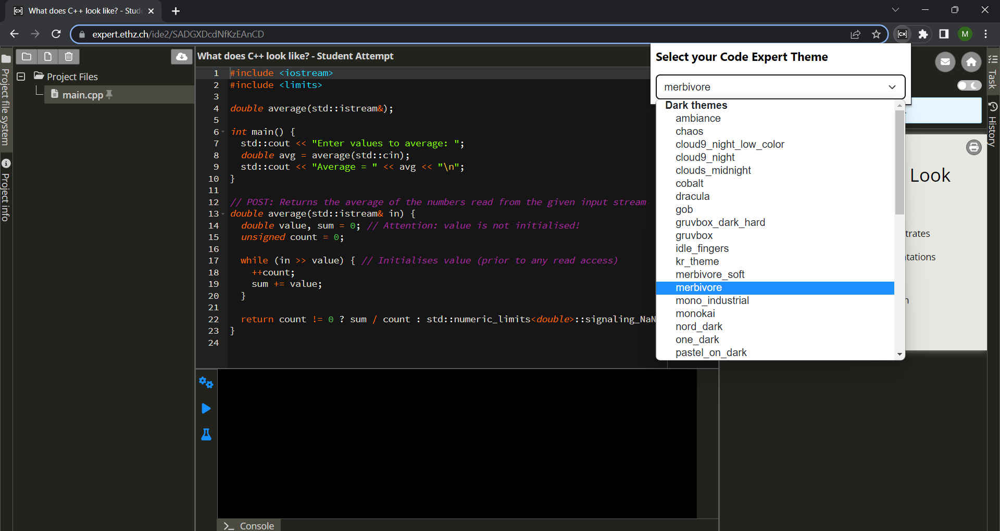

# Code Expert Themes

Add more themes to [Code Expert](https://expert.ethz.ch) a tool widely used at ETH Zurich.

## Usage information

1. Open a project on [Code Expert](https://expert.ethz.ch).
2. In the toolbar click on the extension's icon.
3. Select your preferred theme. You can skip through the list. The IDE's theme is updating simultaneously.

## Manual installation

Install and activate the extension:
1. Clone the repository or download the folder.
2. Open [Extensions](chrome://extensions/) and activate developer mode on the top right.
3. Click on the button "Load unpacked" and select the `dist` folder of this extension.
4. Activate the extension.

## Contribute your custom theme

Please feel free to contribute your custom theme. Just make sure to follow some principles:

* Add your CSS file to the [postcss/custom](./postcss/custom/) folder.
* Add it to the `customThemes` array in [webpack.mix.js](./webpack.mix.js). By default it will be compiled with support for nested CSS selectors. During development you can use the command `npm run watch`.
* Add your theme as an option HTML element to [dist/popup.html](./dist/popup.html).
* Test it in a real Code Expert project and make sure that everything works fine.
* Create your Pull Request.

## Recompile ACE themes

1. Copy the `css/` folder from https://github.com/ajaxorg/ace-builds into `./postcss/themes`.
2. Run `node change-classes.mjs` to change all theme class names to `#ace-editor`.
3. Run `npm run prod` to process all scripts and save them in the `dist/` folder.

## Disclaimer

The extension is **NOT** collecting any of your data. It only loads a new style sheet (CSS) when you load Code Expert.
